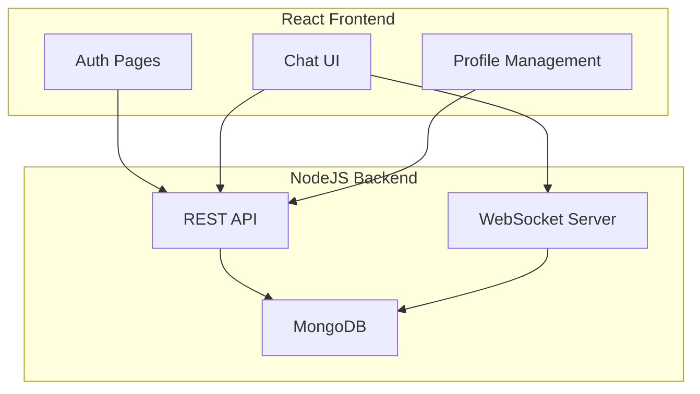

# Fullstack Chat App

## Introduction

Fullstack Chat App is a real-time messaging platform built using the MERN stack. It provides a seamless chat experience through web sockets, supporting one-on-one and group messaging. The application uses robust authentication and maintains chat histories, making it suitable for both personal and professional communication.

## Features

- User authentication with JWT
- Real-time chat via WebSockets (Socket.IO)
- One-on-one and group chat support
- Persistent message histories
- User search functionality
- Profile management
- RESTful API for user, chat, and message operations
- Responsive user interface

## Requirements

- Node.js (v14 or higher)
- npm or yarn
- MongoDB database (local or cloud)
- Modern web browser

## Installation

### 1. Clone the repository

```bash
git clone https://github.com/himanshu427-droid/fullstack-chat-app.git
cd fullstack-chat-app
```

### 2. Install server dependencies

```bash
cd backend
npm install
```

### 3. Set up environment variables

Create a `.env` file in the `backend` directory with the following keys:

```
MONGO_URI=your_mongodb_uri
JWT_SECRET=your_jwt_secret
PORT=5000
```

### 4. Start the backend server

```bash
npm run start
```

### 5. Install client dependencies

In a new terminal window:

```bash
cd frontend
npm install
```

### 6. Start the frontend application

```bash
npm start
```

The frontend will typically run on `http://localhost:3000` and the backend on `http://localhost:5000`.

## Usage

- Register a new account or log in with existing credentials.
- Start new chats by searching for users.
- Create and manage group chats.
- Send and receive messages in real time.
- Manage your profile and view chat histories.

## Architecture Overview

The application is divided into two main parts:

- **Backend**: Node.js + Express server with MongoDB for data persistence. Handles authentication, user management, chat and message routing, and socket communication.
- **Frontend**: React-based user interface, handling authentication, chat UI, and interactions with the backend APIs.

### System Architecture Diagram



## API Endpoints

### User Registration
#### POST /api/user

### User Login
#### POST /api/user/login

### Get All Users
#### GET /api/user?search=query

### Create Chat
#### POST /api/chat

### Fetch User Chats
#### GET /api/chat

### Send a Message
#### POST /api/message

### Fetch Chat Messages
#### GET /api/message/:chatId


---

